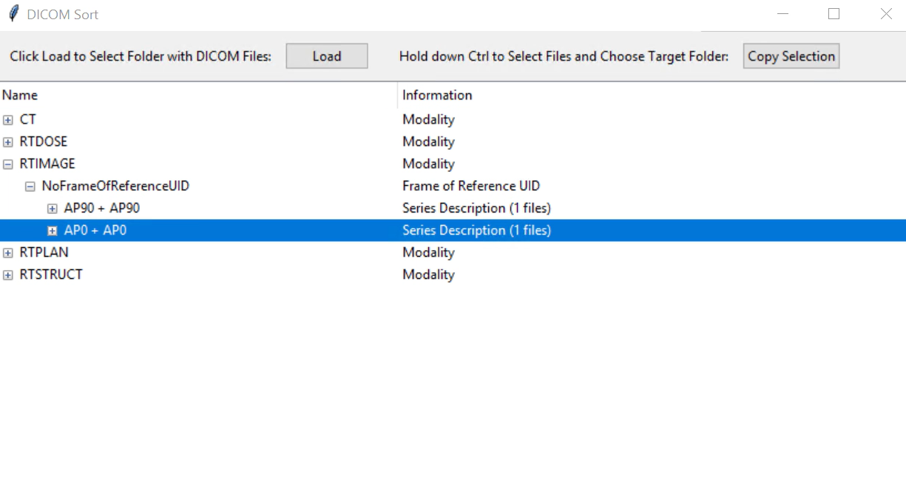

# DICOM Sort & Copy GUI
This simple graphical user interface allows to select a folder with .dcm files, display all files in a tree view and by selecting the desired files, copy them to a target folder. Developed for a radiotherapy application.

## Additional Information
* A docker image to run the code is provided in the `installation` folder. Start the GUI inside the container by running `python /workspace/gui_dicom_sort.py`.
* The DICOM files are sorted according to the Modality, FrameOfReferenceUID and SeriesDescription tags as these tags help to identify the [connections between RTSTRUCT, RTDOSE and RTPLAN](https://pubmed.ncbi.nlm.nih.gov/25147130/).
